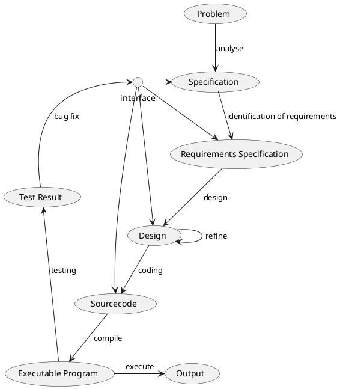
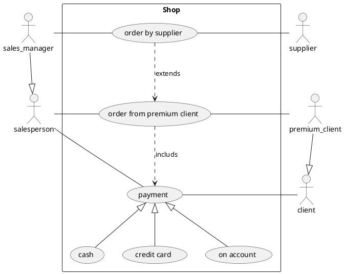
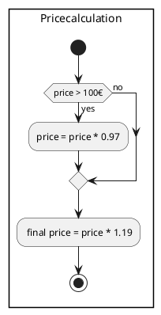
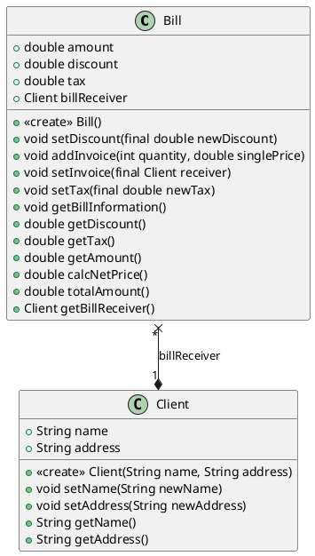

## Getting Started

Welcome to the VS Code Java world. Here is a guideline to help you get started to write Java code in Visual Studio Code.

## Folder Structure

The workspace contains two folders by default, where:

- `src`: the folder to maintain sources
- `lib`: the folder to maintain dependencies

## Dependency Management

The `JAVA PROJECTS` view allows you to manage your dependencies. More details can be found [here](https://github.com/microsoft/vscode-java-dependency#manage-dependencies).

# Introduction

This repo is in scope of a course and shall introduce to java programming language.
It shall demonstrate the dependencies of a shop with all stakeholders and the general software development process.
Depending of the scope of the program, not all descriptions will be described in detail.

# Sofware Development Process

<!---
This plantuml has been used:

-->

# Use Case

The use case of the shop shall show the system with all stakeholders and their interactions.

<!---
This plantuml has been used:

-->

## Use Case Description

This is an example for the use case *order from premium client*

| Use Case        | Order from premium client                                                   |
|-----------------|-----------------------------------------------------------------------------|
| *Description*   | A premium client can set the order by phone or in the shop personally.      |
|                 | It shall be possible to pay with cash, by card or on account.               |
|                 | The bought item can be delivered to customer home address.                   |
|*Stakeholders*   | Salesperson                                         (SP)                    |
|                 | Premium Client                                      (PC)                    |
|                 | Courier                                             (CR)                    |
| *prerequisite*  | The ordered item shall be on stock or can be ordered by supplier on time.   |
| *postcondition* | The item was delived to the client and the corresponding amount was payed.  |
| *Trigger*       | Premium client calls or enters the shop.                                    |

| Standard Sequence |    |                                                                      |
|-------------------|----|----------------------------------------------------------------------|
| 1.                | PC | The client selects the desired product.                              |
| 2.                | SP | Salesperson makes sure that the product is on stock.                 |
| 3.                | PC | The client can provide valid client number, deliver date and address. |
| 4.                | SP | Salesperson captures the data and calculates the price.              |
| 5.                | PC | Premium client pays cash (--> Use Case "cash").                      |
| 6.                | CR | The courier delivers the desired product at the desired date.        |
          
| Alternativ Sequence |    |                                                                                       |
|---------------------|----|---------------------------------------------------------------------------------------|
| to 1.               | PC | The client selects the desired product via phone.                                     |
| to 5.               | PC | The client states credit card number via phone (--> Use Case "credit card")           |
| to 5.               | PC | The client pays with credit card (--> Use Case "credit card")                         |
| to 5.               | SP | The client pays by arrival of the product by cash (--> Use Case "cash")               |
| to 5.               | PC | The client pays on account before the delivery of the product. (--> Use Case "cash"). |

| Extended          |    |                                                                      |
|-------------------|----|----------------------------------------------------------------------|
| to 2.             | SP | The desired product in not stocked and need to be ordered by sales manager (--> Use Case "order by supplier"). |

| Faulty Situations   |    |                                                                                       |
|---------------------|----|---------------------------------------------------------------------------------------|
| to 2.               | SP | Desired product is not stocked and cannot be delivered on time.                       |
|                     |    | Use case will be cancelled and order will be set (--> Use Case "order by supplier").  |
| to 3.               | PC | The client states wrong credit card number. Use Case will be cancelled.               |
| to 5.               | PC | The client does not pay in time; it won't be delivered.                               |

## Activity diagram

This shall show one acitvity diagram of the program. The customer shall receive a 3% discount on the purchase, if  the amount is higher than 100 €.

<!---
This plantuml has been used:

-->

# Class

This chapter shall describe all classes and their interactions

<!---
This plantuml has been used:

-->

# Future Tasks

- All classes need to be displayed how they interact to each other.
- Backend: It shall be possible to read/write clients in the exisiting database
- Frontend: design with login functionality for customer